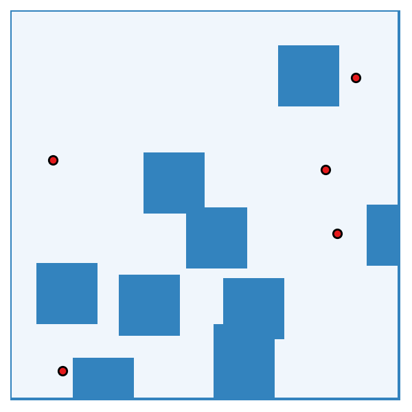
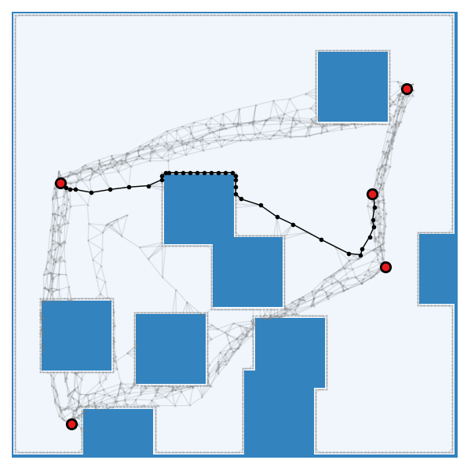
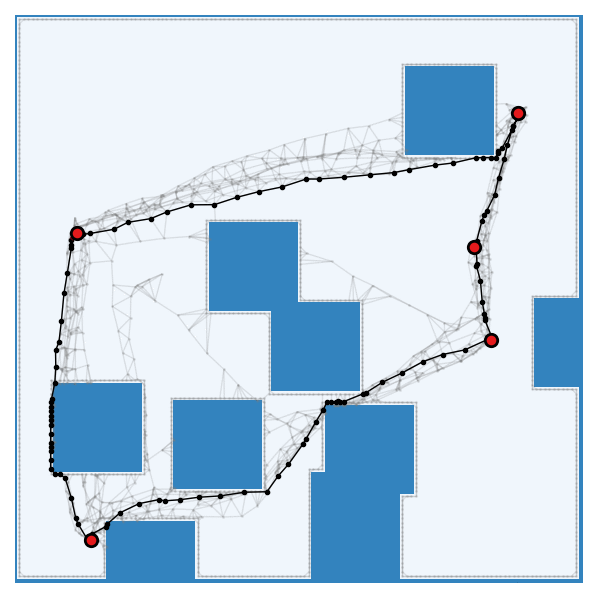

# TSPDiffuser: Diffusion Models as Learned Samplers for Traveling Salesperson Path Planning Problems in Obstacle-Rich Environments (ICRA 2025)

| | | |
| --- | --- | --- |
|  |  |  |

This repository presents minimum working examples for the following paper:

Ryo Yonetani, "TSPDiffuser: Diffusion Models as Learned Samplers for Traveling Salesperson Path Planning Problems in Obstacle-Rich Environments", ICRA 2025 [[arXiv](https://arxiv.org/abs/2406.02858)]


## Prerequisites

- ```python>=3.10```
- ```uv```

See [pyproject.toml](pyproject.toml) for the full list of dependencies. If you wish to reproduce our training and evaluation, please install the minimum version specified for each dependency package along with Python 3.10.

## Installation

```console
$ git clone git@github.com:CyberAgentAILab/tsppp.git
$ uv sync --frozen
```

We also provide a [Dockerfile](docker/Dockerfile) for running the code in a container.

```console
$ docker build -f docker/Dockerfile -t tsppp .
$ docker run -it --rm -v $PWD:/workspace tsppp /bin/bash
```


### Downloading checkpoints
Download the pre-trained model checkpoints from the following link and extract the contents to the root directory of the repository.

```console
$ wget https://github.com/CyberAgentAILab/tsppp/releases/download/v0.1.0-release/checkpoints.tgz
$ tar -xvzf checkpoints.tgz 
```

### Testing the installed package

```console
$ CUDA_VISIBLE_DEVICES= .venv/bin/pytest -v 
```

### Downloading real-world datasets

- Download the City Street Map Dataset from the [2D Pathfinding Benchmarks page](https://movingai.com/benchmarks/grids.html), place the contents in `data/street-png`, and remove files other than `*_256.png` from the dataset.
- Download the Indoor Navigation Dataset from the [Indoor Navigation 2D Data Set page](https://www.vicos.si/resources/in2d/), place the contents in `data/adwa_iros2020_benchmark`, and remove `Sister1.png` and `Sister2.png` from the dataset.


## Planning Examples

We assume evaluation to be done on CPUs. See [notebooks/tutorial.ipynb](notebooks/tutorial.ipynb) for a more detailed introduction.


### Solving TSPPP with PRM
```console
$ uv run scripts/evaluate.py solver=prm_default num_instances=1
[...][__main__][INFO] - map_type='standard', num_destinations=10, graph_type='random_1000_r'
[...][__main__][INFO] - result.status=True, pathlen=312.81, time=2.43
```

### Solving TSPPP with TSPDiffuser
```console
$ uv run scripts/evaluate.py solver=tspdiffuser_default num_instances=1
[...][__main__][INFO] - map_type='standard', num_destinations=10, graph_type='tspdiffuser_10_5'
[...][__main__][INFO] - result.status=True, pathlen=281.87, time=1.34
```

## (Advanced) Benchmarking Planners

### Step 1: Generating ground-truth solutions
```console
$ uv run scripts/evaluate.py map_creator=standard solver=prm_gt
```

### Step 2: Benchmarking planners
```console
$ reference_stats=results/standard_010/random_3000_r/stats.txt
$ uv run scripts/evaluate.py map_creator=standard solver=prm_default reference_stats=$reference_stats
$ uv run scripts/evaluate.py map_creator=standard solver=tspdiffuser_default reference_stats=$reference_stats
$ uv run scripts/evaluate.py map_creator=standard solver=cprm_default reference_stats=$reference_stats
```

## (Advanced) Training TSPDiffuser / Critical PRM from Scratch

### Step 1: Generating training dataset

We recommend using multi-cpu instances for generating datasets in parallel. It took approximately 7 hours with `n1-highcpu-64` instance on Google Cloud Platform.

```console
$ uv run scripts/generate_training_data.py
```

### Step 2: Training models
GPU is required for training. Each training will take approximately 5 days on NVIDIA Tesla T4.

```console
# TSPDiffuser
$ uv run scripts/train_ddpm.py

# Critical PRM
$ uv run scripts/train_cprm.py
```


## Citation
```
@inproceedings{yonetani2024tspdiffuser,
  author    = {Ryo Yonetani},
  title     = {TSPDiffuser: Diffusion Models as Learned Samplers for Traveling Salesperson Path Planning Problems in Obstacle-Rich Environments},
  title={Decentralized learning of generative adversarial networks from non-iid data},
  booktitle={Proceedings of the IEEE International Conference on Robotics and Automation (ICRA)},
  year={2025}
}
```